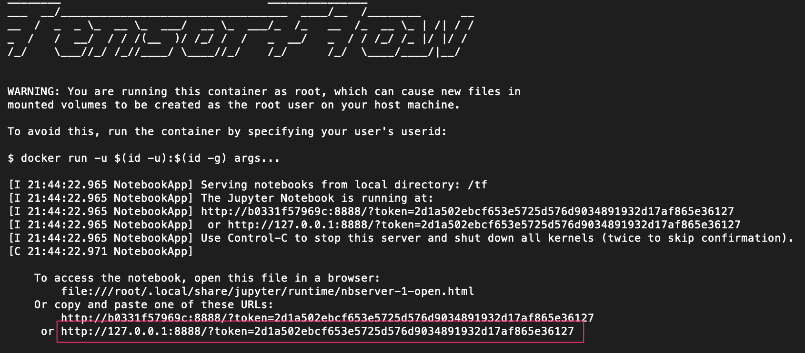
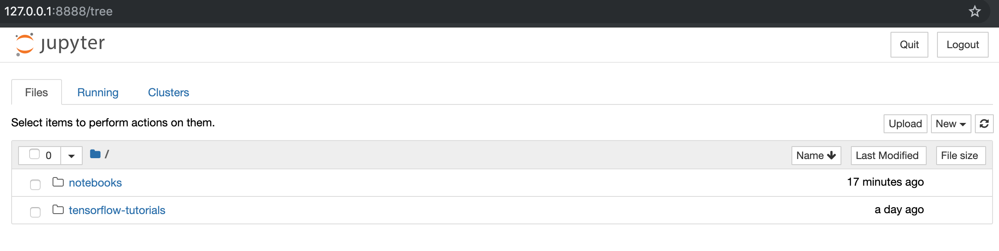

# LetsMakeMLBoringAgain

## Setup

The exercises could be run locally using docker or in some cloud service for jupyter notebooks like Google Colab.

### Google colab

Go to https://colab.research.google.com/

File -> Open notebooks -> notebooks/Exercises.ipynb

### (or) Local with docker

Run these commands in the project directory

```
docker-compose build
docker-compose up
```

If successful, you should see this in the terminal:



Open the url in a browser.

If successful, you should see this in the browser:



Great! You are setup! You can find the exercises from notebooks folder.

Happy coding :nerd_face:
